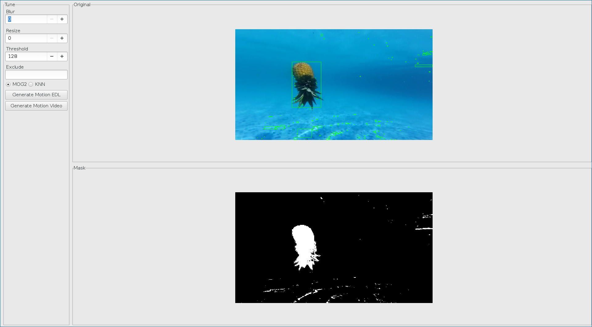

= CamToNES
Jesús Espino, <jespinog@gmail.com>
v0.0.1
:toc: left
:!numbered:
:idseparator: -
:idprefix:
:source-highlighter: pygments
:pygments-style: friendly
:sectlinks:

== Introduction

_CamToNES_ (Camera To Not-Empty Sequence) is command line interface for process
security camera videos for process motion and faces.

=== Rationale

I start writting this program because I need to review hours of security camera
videos and that's sounds really boring and time consuming. The main objetive is
to easy the task of reviewing static camera videos applying motion detection
through Background substracion

Here a incomplete list of things that _CamToNES_ aims to archieve:

* Have a simple interface to use OpenCV in for extract motion and faces from videos.
* Provide a simple way to tune the parameters for correctly detect relevant motion.
* Provide a simple way to realtime detection of movement and faces.

And _CamToNES_ goals are not:

* To be a fully feature interface to OpenCV.
* To provide an exaustive set of tune parameters.

=== Project Maturity

Since _CamToNES_ is a young project there can be some API breakage.

=== Dependencies

_CamToNES_ depends on OpenCV 3.0 and python >= 2.7.

=== Install

To use _CamToNES_ you can install it through pypi:

[source,bash]
----
pip install camtones
----

[[quickstart]]
== Quick Start

The best approach to start to understand how to process a video with _CamToNES_
is using the _motion_wizard_ command.

[source,bash]
----
camtones motion_wizard my_video_file.avi
----

You will see something like this:

.Motion Wizard

The motion wizard allow you to "tune" the parameters used to extract the motion
sections from a video file.

=== Tunning

You can see the link:#tunning-motion-parameters[Motion Detection/Extraction Parameters] section to
understand better the porpose and the behavior of each paramter.

=== Running extraction

After ensure that you have tunned it correctly, you can start to capture it in
a new video file, or an .edl file.

This will have the same behavior if you run the
link:#motion-extraction[motion_extract] or
link:#motion-extraction-edl[motion_extract_edl] commands in the command line, with
the parameters defined in the wizard.

== Commands

[[motion-detection]]
=== Motion detection

The motion detection reproduce a video or use the video of the webcam, and draw
a rect on the detected motion.

For example, you can view motion detected by your webcam with the next command:

[source,bash]
----
camtones motion_detect 0
----

or the same with a video with

[source,bash]
----
camtones motion_detect my_video_file.avi
----

You can tune it with some link:#tunning-motion-parameters[Motion Detection/Extraction Parameters].

[[motion-extraction]]
=== Motion extraction

The motion extraction generate a video containing only the frames that have motion on it.

This command have the _--show-time_ special option that draw a timer that refer
the time of the original video.

For example, you can generate a motion only video from a security camera video
with the next command:

[source,bash]
----
camtones motion_extract --progress --show-time --exclude "rect.area < 10000" my_video_file.avi my_motion_only_video.avi
----

The _--progress_ option enable a progress bar.

You can tune it with some link:#tunning-motion-parameters[Motion Detection/Extraction Parameters].

[[motion-extraction-edl]]
=== Motion extraction edl

The motion extraction edl generate a edl file (Edit decision list) containing the information to skip no motion sections of the video.

For example, you can generate a edl file for a security camera video
with the next command:

[source,bash]
----
camtones motion_extract_edl --progress --exclude "rect.area < 10000" my_video_file.avi my_video_file.edl
----

The _--progress_ option enable a progress bar.

After generating the edl file, you can reproduce it with the next _mplayer_
command:

[source,bash]
----
mplayer -edl my_video_file.edl my_video_file.avi
----

You can tune it with some link:#tunning-motion-parameters[Motion Detection/Extraction Parameters].

[[face-classifiers]]
=== Classifiers

The classifiers command list the included in _CamToNES_ classifiers for face detection/extraction.

[[face-detection]]
=== Face detection

The motion detection reproduce a video or use the video of the webcam, and draw
a rect on the detected faces.

For example, you can view face detected by your webcam with the next command:

[source,bash]
----
camtones face_detect --classifier frontalface_default 0
----

or the same with a video with

[source,bash]
----
camtones face_detect --classifier frontalface_default my_video_file.avi
----

You can understand better how face detection works in the section link:#tunning-face-parameters[Face Detection/Extraction Parameters].

[[face-extraction]]
=== Face extraction

The face extraction generate a set of files containing faces detected in the video.

For example, you can extract faces from a security camera video with the next
command:

[source,bash]
----
mkdir faces
camtones face_extract --progress  --classifier frontalface_default my_video_file.avi faces
----

The _--progress_ option enable a progress bar.

You can understand better how face detection works in the section link:#tunning-face-parameters[Face Detection/Extraction Parameters].

== Tunning parameters

[[tunning-motion-parameters]]
=== Motion detection/extraction

The motion extraction/detection get the images of a video, and process it to
detect changes between one frame and the previous. This approach, normally,
generate a lot of false positives because we are searching for big solid
objects in the camera, not small leafs moved by the wind.

For remove this false positive _CamToNES_ process the diferences image to
remove this false positive.  But the false positive can means diferent things
for different videos, this is the reason to need tunning the extraction.

==== The Process

To filter the image, _CamToNES_ follow the next process. Get a frame from the
video, resize it (if the user have define a link:#motion-resize[resize]
parameter), process it through a background extraction
link:#motion-algorithms[algorithm] (MOG2 or KNN). As result, we get a mask of
diferences between the background and the current frame.

After get the differences mask, we apply to this mask the
link:#motion-blur[blur] defined by the user.

After bluring the mask, we discard all grays, using the _threshold_ provided by
the user, this means, that every gray darker than the threshold will be black,
and every gray lighter than the threshold will be white.

Every white element remaining in the mask after this process will generate a
_rectangle_ result.

This rectangles are filtered by the _exclude_ parameter.

If a frame have a not-excluded rectangle, the frame is a motion frame, else, is
a static frame.

[[motion-resize]]
==== Resize

You can resize the image before processing with the _--resize_ option. This is
done for process the result faster or for discard some video imperfections.

The value must be a number of pixels of the new width of the frames.

[[motion-algorithms]]
==== Algorithms

You can defined with the _--subtractor_ parameter the algorithm to use, normally
MOG2 and KNN, but depends on your installation. You can see all supported
algorithms running _motion_detect_, _motion_extract_ or _motion_extract_edl_
with the _--help_ option.

The value must be one of the allowed options (normally MOG2 or KNN).

[[motion-blur]]
==== Blur

You can blur the mask to remove camera imperfections or irrelevant small
movments with the _--blur_ option.

The value must be a number of pixels.

[[motion-threshold]]
==== Threshold

You discard gray zones in the mask with the _--threshold_ option (this normally
combined with the blur allow to remove imperfections or small movementes). The
KNN and MOG2 algorithms detect shadows and assign the gray with value 127 to
the shadows.

The value must be a number between 0 and 255.

[[motion-exclude]]
==== Exclude

You can exclude result rectangles with the _--exclude_ option. This option
recive a python expresion that is evaluated to True or False. If the expression
evaluate to True, the rectangle is discarded.

The value must be a valid python expresion, and you will have access to the
variables _rect_ and _frame_.

The _rect_ variable will have the attributes x, y, width, height and area.

The _frame_ variable will have the attributes width, height and area.

You can use it, for example, to discard any movement with an area smallar than
10000 pixels with the next expression:

[source,python]
----
rect.area < 10000
----

=== Face detection/extraction

The face detection is really a object recognition system based on Haar
features. This only means that you can detect objects based on files generated
through machine learning. OpenCV comes with some of this files that are
included in _CamToNES_.

You can define your classifier with the parameter _--classifier_ in the
_face_detect_ and _face_extract_ commands.

And you can list the available classifiers with the _classifiers_ command:

[source,bash]
----
camtones classifiers
----

You can use any of this classifiers or use another one using the _--classifier_
option with the file path as parameter.

== Contributing

=== Philosophy

Five most important rules:

- Beautiful is better than ugly.
- Explicit is better than implicit.
- Simple is better than complex.
- Complex is better than complicated.
- Readability counts.

All contributions to _CamToNES_ should keep these important rules in mind.

=== Source Code

_CamToNES_ is open source and can be found on
link:https://github.com/jespino/catacumba[github].

You can clone the public repository with this command:

[source,text]
----
git clone https://github.com/jespino/catacumba
----

=== License

_CamToNES_ is licensed under BSD (2-Clause) license:

----
Copyright (c) 2015 Jesús Espino <jespinog@gmail.com>

All rights reserved.

Redistribution and use in source and binary forms, with or without
modification, are permitted provided that the following conditions are met:

* Redistributions of source code must retain the above copyright notice, this
  list of conditions and the following disclaimer.

* Redistributions in binary form must reproduce the above copyright notice,
  this list of conditions and the following disclaimer in the documentation
  and/or other materials provided with the distribution.

THIS SOFTWARE IS PROVIDED BY THE COPYRIGHT HOLDERS AND CONTRIBUTORS "AS IS"
AND ANY EXPRESS OR IMPLIED WARRANTIES, INCLUDING, BUT NOT LIMITED TO, THE
IMPLIED WARRANTIES OF MERCHANTABILITY AND FITNESS FOR A PARTICULAR PURPOSE ARE
DISCLAIMED. IN NO EVENT SHALL THE COPYRIGHT HOLDER OR CONTRIBUTORS BE LIABLE
FOR ANY DIRECT, INDIRECT, INCIDENTAL, SPECIAL, EXEMPLARY, OR CONSEQUENTIAL
DAMAGES (INCLUDING, BUT NOT LIMITED TO, PROCUREMENT OF SUBSTITUTE GOODS OR
SERVICES; LOSS OF USE, DATA, OR PROFITS; OR BUSINESS INTERRUPTION) HOWEVER
CAUSED AND ON ANY THEORY OF LIABILITY, WHETHER IN CONTRACT, STRICT LIABILITY,
OR TORT (INCLUDING NEGLIGENCE OR OTHERWISE) ARISING IN ANY WAY OUT OF THE USE
OF THIS SOFTWARE, EVEN IF ADVISED OF THE POSSIBILITY OF SUCH DAMAGE.
----
